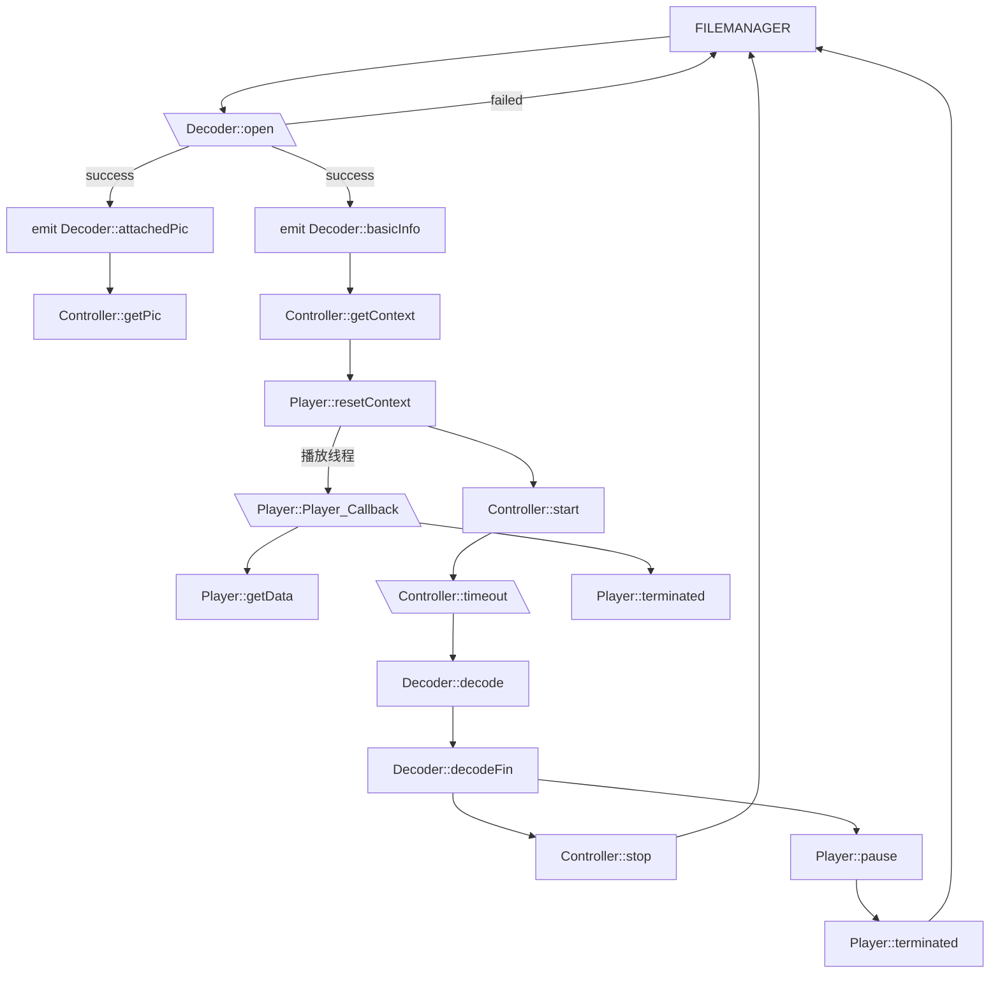

# BricMusic音乐播放器

主要的架构分成三部分

## 先写需求

1. 播放/暂停
2. 切换曲目
3. 随机/单曲/循环的播放模式
4. 歌词
5. 设置音量
6. 制作歌单

## FFMpeg解码器

尽量只和GUI、FIFO队列交互，减少与SDL的交互

构造函数

- ```C++
  Decoder(QObject* parent = Q_NULLPTR);
  ```

发送的信号

1. 基本音频格式

   ```c++
   void basicInfo(AVSampleFormat sampleFormat,	int channel_layout,	int sample_rate);
   ```

2. 解专辑图

   ```C++
   void attachedPic(uchar* pic_data,int size);
   ```

3. 解码完成

   ```C++
   void decodeFin();
   ```

槽

1. 新的解码任务

   ```C++
   void decode(FIFO&);//剩余空间sz
   ```

2. 切换解码位置

   ```C++
   void flush(unsigned int timeStamp);
   ```

函数

1. 读音频文件

   ```C++
   int open(const char* filepath);
   ```

## SDL播放器

发送的信号

1. 播放完成
2. 请求数据（本线程请求）

槽

1. 暂停/开始
2. 新的播放任务

这里要注意的是计算缓冲区大小，设定大小为`SDL_AudioSpec.samples` = `samples`/`privateVolume`，

## Qt框架

- UI界面

还是用之前的几个小控件去做这个东西，但是要改BUG

- 逻辑中间件

  状态信息被放在这里

1. 播放/暂停

   更改状态信息，然后发送暂停信号

2. 切换曲目

3. 随机/单曲/循环的播放模式

4. 歌词

5. 设置音量

6. 制作歌单

发送的信号

1. 暂停信号
2. 播放信号
3. 解码暂停
4. 解码继续

槽

1. 队列满

   这个主要是检查播放状态，然后安排FFMpeg启停

2. 切换曲目

   禁止接收播放暂停切换曲目的信号（通过状态位）

   由FFMpeg解出缓冲区空间大小，分析是否开辟缓冲区。
   全部妥当后，发送播放信号和解码继续的信号

3. 切换播放模式

   改下状态位

4. 歌词

   显示、关闭歌词

5. 设置音量

   

## Controller

这个Controller要维护一个FIFO队列，并封装所有Decoder和Player的接口。




## 播放过程

1. 文件调度
2. 开启解码
3. Decoder获得解码格式,生成缓冲区
4. 打开播放器，
5. 发送缓冲区到Controller
6. 开启定时器
   - 缓冲区不满则调用解码
7. 开启播放器
8. （解码器结束）发送暂停
9. 等待播放结束
10. 返回文件调度